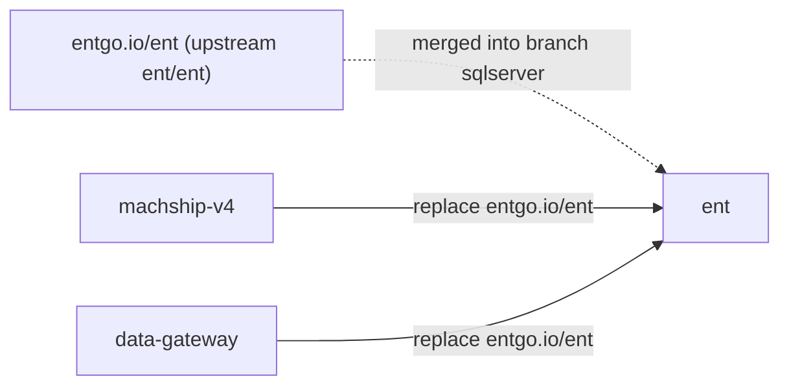

```mermaid
flowchart LR
  %% Package lines: each repo replaces entgo.io/ent with github.com/machship/ent (branch sqlserver).
  upstream["entgo.io/ent (upstream ent/ent)"] -.->|merged into branch sqlserver| ent
  machship-v4 -->|"replace entgo.io/ent"| ent
  data-gateway -->|"replace entgo.io/ent"| ent
```

All lines are build-time Go module imports. At runtime the generated code runs inside each
importing service and talks to its SQL Server database.
